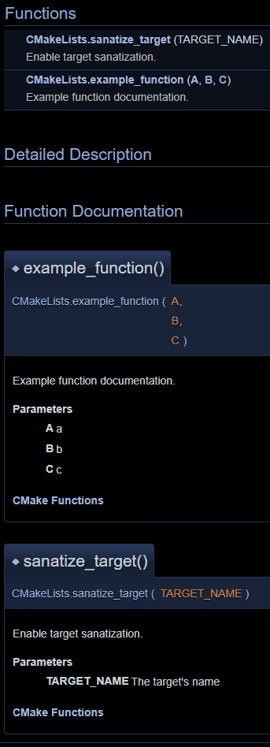

# Doxygen Everything

Toy project to experiment with Doxygen and CMake.

Especially documenting CMake files and integrate it into Doxygen.

## Document CMake Files using Doxygen

- Treat CMake files as Python files ( both languages use `#` for comments, both have keyword agruments ) 
    - Doxygen supports Python
- Parse CMake `function`, `macro` and `option` lines and generate Python functions/variables 
- Group CMake `function`, `macro` and `option` into Doxygen groups

__EXAMPLE__

__${CMAKE_CURRENT_LIST_DIR}/CMakeLists.txt__
```cmake
## @brief Example macro documentation
## @param X x
## @param Y y
## @param Z z
macro(example_macro X Y Z)
    ...
endmacro()
```
__${CMAKE_CURRENT_BINARY_DIR}/CMakeLists.txt (.py)__
```py
## @brief Example macro documentation
## @param X x
## @param Y y
## @param Z z
##
## @ingroup cmake_macros
## @ref cmake_macros
def example_macro(X, Y, Z):
	pass
```

|||
|-|-|
|||